# <center>如何使用 serverless 部署前端项目</center>

## 一、使用`serverless`部署`vue3`项目

### 1、使用脚手架创建一个`vue3`项目

我们先初始化一个`vue3`项目

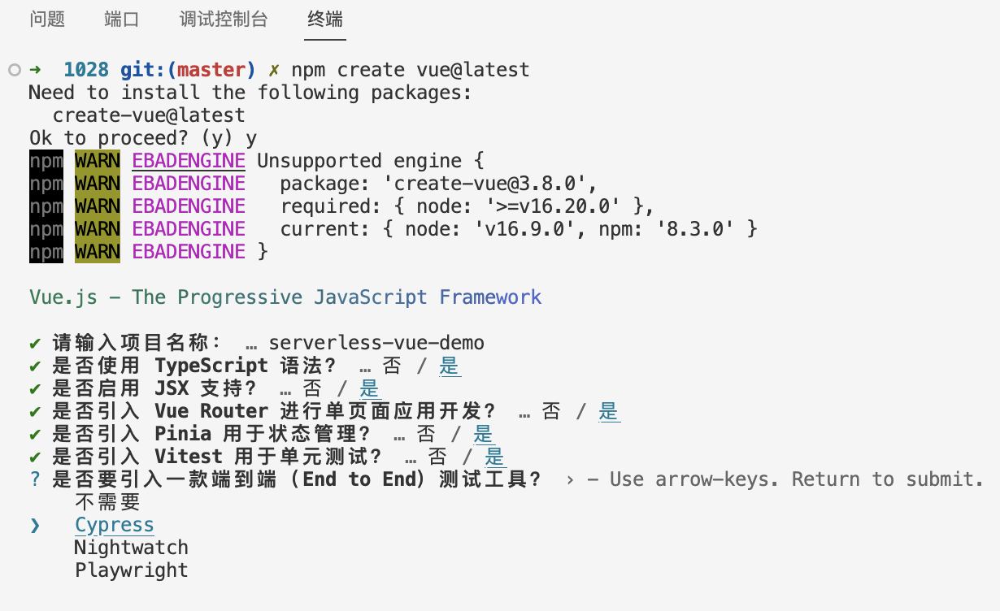

```bash
npm create vue@latest
```

启动项目看下：

```bash
npm run dev
```

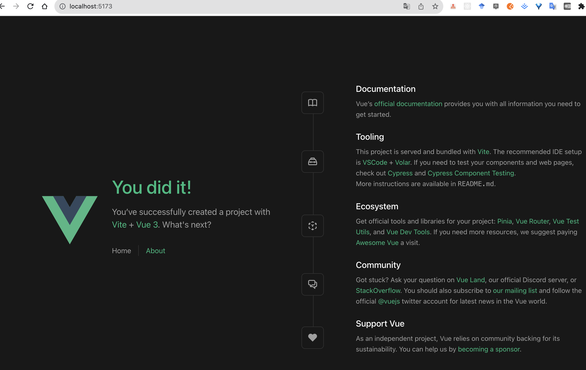

没啥问题

### 2、将 `vue3` 项目包装成 `Serverless` 应用

### 3、安装 Serverless Framework

通过 `npm` 安装最新版本的 `Serverless Framework`

```bash
npm install -g serverless
```

### 4、初始化一个 `serverless` 应用

快速创建一个`serverless`应用

```bash
serverless init website-starter --name example
```

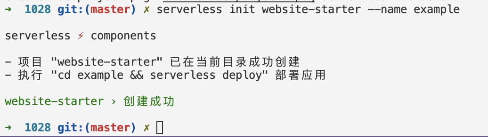

### 5、移植 `serverless.yml`

将这个`serverless.yml`文件复制到刚刚创建的`vue3`项目中，然后删除 `website-starter` 目录

现在的目录结构是这样的：

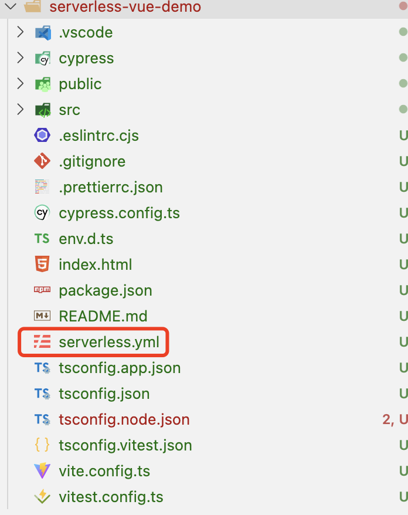

### 6、调整下 `serverless` 配置文件

简单的修改下：

增加了 `dist` 的目录位置为 `./dist`，更改了 `bucketName` 为 `my-vue-starter`

```yaml
component: website # (必填) 引用 component 的名称，当前用到的是 tencent-website 组件
name: websitedemo # (必填) 该 website 组件创建的实例名称
app: example-fc928772 # (可选) 该 website 应用名称

inputs: # 配置输入参数的部分
  src: # 指定源代码的位置
    src: ./src # 源代码的路径
    index: index.html # 网站的入口文件
    error: index.html # 错误页面的文件
    dist: ./dist # 构建后的代码的输出路径
  region: ap-guangzhou # 网站所在的地区/区域
  bucketName: my-vue-starter # 存储网站文件的存储桶名称
  protocol: https # 网站使用的协议（这里是HTTPS）
```

解释下这个配置文件，源代码位于 `./src` 目录下，入口文件为 `index.html`，错误页面也使用同一个文件。构建后的代码输出到`./dist`目录。网站将部署在 `ap-guangzhou` 地区，并使用名为 `my-vue-starter` 的存储桶来存储网站文件。

更多配置查看[全量配置及配置说明](https://github.com/serverless-components/tencent-website/blob/master/docs/configure.md)

### 7、集成自动构建能力

有的同学会问了，上面的 `dist` 需要每次在项目部署前都要先`npm run build`，然后再将打包后的`dist`目录传到服务器上的`nginx`静态目录下，这样才能访问，这个步骤可以走`CI`(持续集成)吗？

答案是可以的，我们可以将自动构建的能力集成到`serverless`部署流程中，只要配置下 `hook`，在每次发布的时候会先执行 `build`，就像 `github hook` 或者 `github actions`

```yaml
# serverless.yml文件
component: website
name: vue-starter
app: vue-demo-6cb9842a

inputs:
  src:
    src: ./src
    # 配置了这个hook每次发布的时候会先build
    hook: npm run build
    dist: ./dist
  bucketName: my-vue-starter
  protocol: https
```

### 8、部署`serverless`应用

这一步就会先走代码编译构建，然后执行serverless的部署流程，直接将代码推送到云端

```bash
serverless deploy
```

不幸的是，编译过程遇到报错：

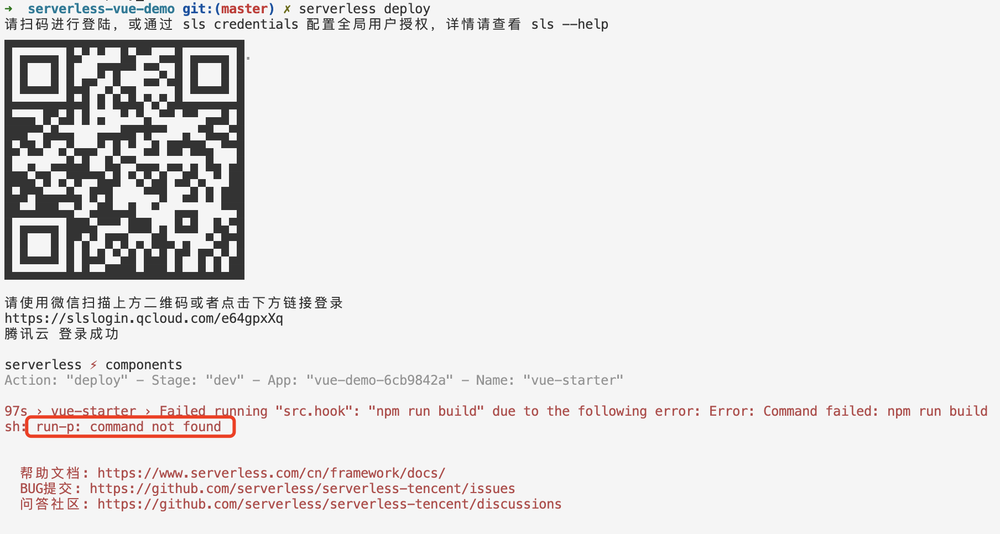

提示`sh: run-p: command not found`，原因是 `run-p` 这个命令找不到，我们安装下：

```bash
npm i npm-run-all -D
```
再重新部署下试试：

```bash
serverless deploy
```

部署完毕后，就可以在命令行的输出中查看到静态站点 URL 地址，点击地址访问看下：

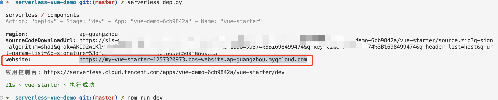

`本地开发服务` 和 `serverless` 上的服务是一样的:

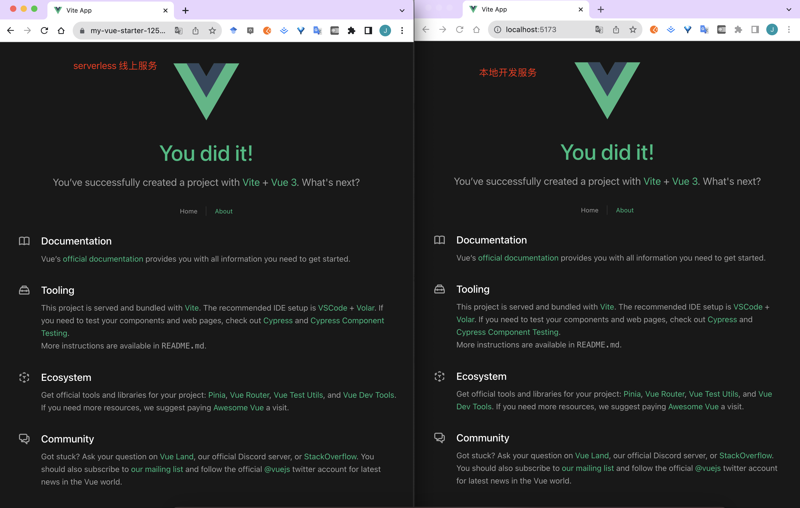

这样，我们就完成了使用 `serverless` 来部署 `vue3` 项目

## 二、部署`react`项目

### 1、快速创建一个`react`项目

```bash
npx create-react-app serverless-react-demo --template typescript
```

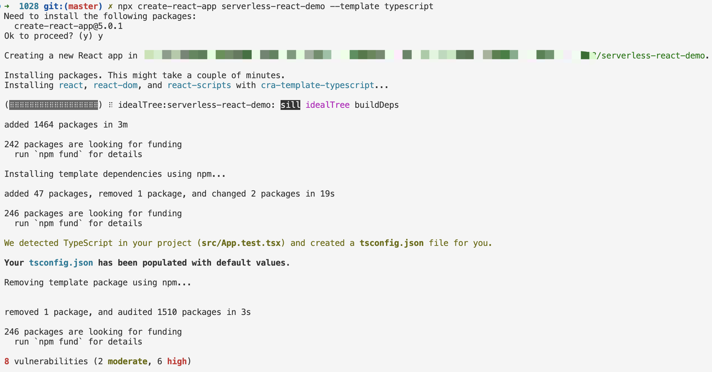

启动看下效果：

```bash
npm run start 
```

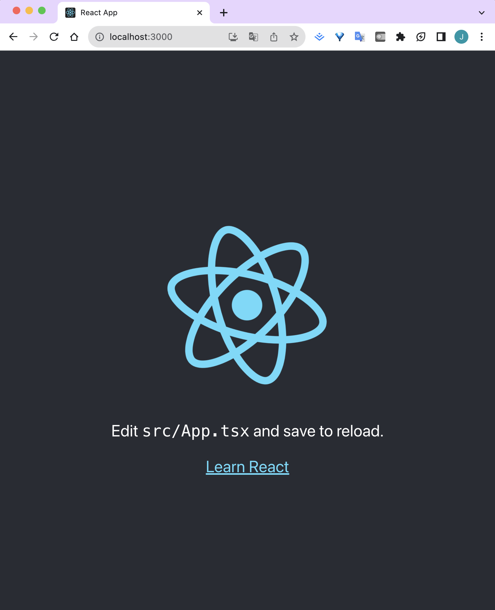

### 2、在`react`根目录下创建一个`serverless.yml`的文件

我们再快速创建一个 `serverless` 应用：`react-starter`

```bash
serverless init website-starter --name react-starter 
```

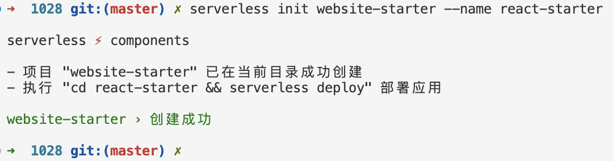

老规矩，将 `serverless.yml` 文件提到我们创建的`serverless-react-demo`跟目录下，然后删除 `react-starter` 目录

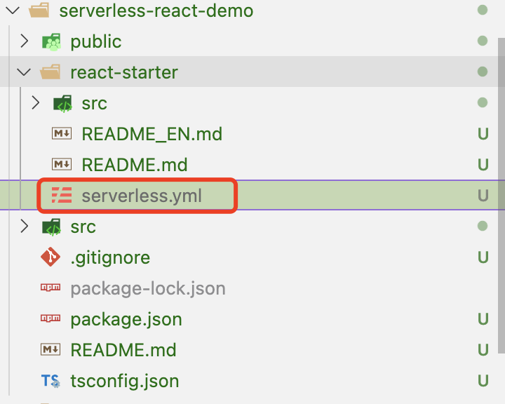

我们改下`serverless.yml`文件：

- 将打包后的静态文件目录 `dist` 目录改成 `./build`

```yaml
component: website
name: react-starter
app: react-starter-7ae90038

inputs:
  src:
    src: ./src
    hook: npm run build
    index: index.html
    error: index.html
    dist: ./build
  region: ap-guangzhou
  bucketName: my-react-starter
  protocol: https
```

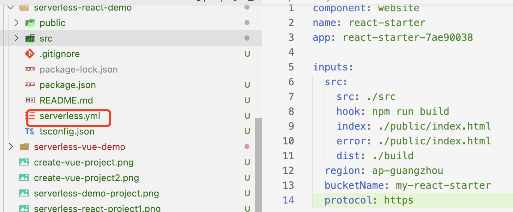

### 3、部署`serverless`应用

```bash
serverless deploy
```

部署完毕后，点击地址访问看下：

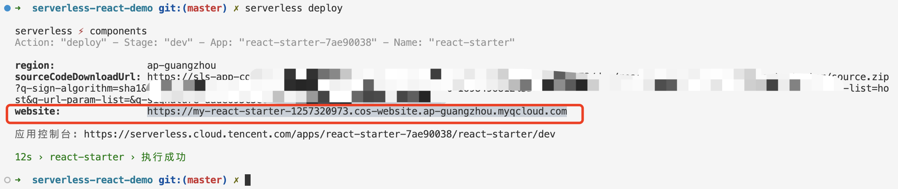

看了下，`本地开发服务` 和 `serverless` 上的服务也是一样的:

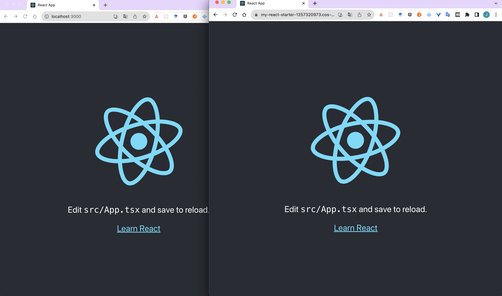

这样，我们就完成了使用 `serverless` 来部署 `react` 项目

## 三、部署`angular`项目

部署方式和上面手动部署`vue` 和 `react`类似，这就不重复的写了

[案例代码](https://github.com/GolderBrother/serverless-deploy-fe-framework)

## 总结

这节课，我们学习了使用 `serverless` 来部署前端三个框架的方式，其实不难，总结就以下几个步骤：

- 1、快速创建一个 `serverless` 应用
- 2、将前端项目**包装**成 `serverless` 应用
  - 将`serverless` 应用的配置文件`serverless.yml`文件添加到前端项目内
  - 调整 `serverless.yml` 配置内容
    - 更改打包后的静态文件目录 `dist` 指向
    - 将自动构建能力集成到`serverless`部署流程中，添加hooks执行代码编译
- 3、部署`serverless`应用，执行代码编译构建和推送资源到云端

## 参考文档

- [tencent-website](https://github.com/serverless-components/tencent-website/)